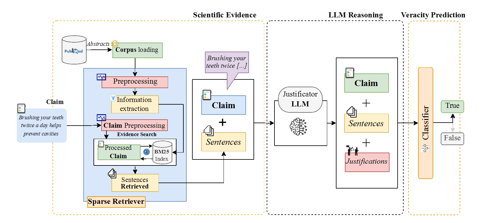

# ✔️🩺 Fact-Checking Biomedical Claims: *C*ombining *E*vidence and *R*easoning (CER)

<div align="center">
    <a href="LICENSE" target="_blank"></a>
</div>
<hr>

In the digital age, verifying the accuracy of medical information is crucial to prevent the spread of harmful misinformation. To address this, we have developed an automated fact-checking system that leverages PubMed, a comprehensive biomedical knowledge base, alongside a Large Language Model (LLM) to assess the veracity of medical claims. The system generates justifications for the claims and classifies them using zero-shot and fine-tuned models. Extensive experimentation highlights that fine-tuning improves robustness across diverse datasets, ensuring higher accuracy in fact-checking.

### 🔍 Scientific References

This project leverages cutting-edge research in Generative AI, recommender systems, and sports analytics. If you use this project for your research, please cite [this paper](https://dl.acm.org/doi/10.1145/3726302.3729931) 🙏.
```bash
@inproceedings{10.1145/3726302.3729931,
author = {Barone, Mariano and Romano, Antonio and Riccio, Giuseppe and Postiglione, Marco and Moscato, Vincenzo},
title = {Combining Evidence and Reasoning for Biomedical Fact-Checking},
year = {2025},
isbn = {9798400715921},
publisher = {Association for Computing Machinery},
address = {New York, NY, USA},
url = {https://doi.org/10.1145/3726302.3729931},
doi = {10.1145/3726302.3729931},
abstract = {Misinformation in healthcare, from vaccine hesitancy to unproven treatments, poses risks to public health and trust in medical systems. While machine learning and natural language processing have advanced automated fact-checking, validating biomedical claims remains uniquely challenging due to complex terminology, the need for domain expertise, and the critical importance of grounding in scientific evidence. We introduce CER (Combining Evidence and Reasoning), a novel framework for biomedical fact-checking that integrates scientific evidence retrieval, reasoning via large language models, and supervised veracity prediction. By integrating the text-generation capabilities of large language models with advanced retrieval techniques for high-quality biomedical scientific evidence, CER effectively mitigates the risk of hallucinations, ensuring that generated outputs are grounded in verifiable, evidence-based sources. Evaluations on expert-annotated datasets (HealthFC, BioASQ-7b, SciFact) demonstrate state-of-the-art performance and promising cross-dataset generalization. Code and data are released for transparency and reproducibility: https://github.com/PRAISELab-PicusLab/CER},
booktitle = {Proceedings of the 48th International ACM SIGIR Conference on Research and Development in Information Retrieval},
pages = {1087–1097},
numpages = {11},
keywords = {fact-checking, generative ai, healthcare, large language models},
location = {Padua, Italy},
series = {SIGIR '25}
}
```

## 📊 Data Source

- **[PubMed](https://pubmed.ncbi.nlm.nih.gov/)**: Our primary source of scientific evidence, containing over 20.6 million biomedical abstracts.
- **Datasets**:
  - **HealthFC**: A dataset of 750 health-related claims from online search queries, curated by *Vladika et al. (2024)*.
  - **BioASQ-7b**: A dataset of 745 biomedical claims from the *BioASQ Challenge, Nentidis et al. (2020)*.
  - **SciFact**: A dataset of 1.4k expert-written scientific claims with evidence-based labels *Wadden et al. (2020)*

The datasets used for training and testing can be found in the `Datasets` folder of this repository.


## 🛠️ Technologies Used

- **Large Language Models (LLMs)**: We employed **[Mixtral-8x22B-Instruct-v0.1](https://huggingface.co/mistralai/Mixtral-8x22B-Instruct-v0.1)** for reasoning and **PubMedBERT** for the classification of claims.
- **Sparse Retriever**: Utilized for efficient evidence retrieval from PubMed, using an inverted index technique.
- **BM25 Indexing**: Applied to preprocess and index the biomedical abstracts for faster information retrieval.
- **Fine-Tuning**: Implemented to improve the model's classification performance.

  *other experiments with **Dense Retriever**


## 📑 Methodology

Our approach is structured in three key phases:

1. **Evidence Retrieval**: We extract relevant scientific abstracts from PubMed using the Sparse Retriever to support or refute each claim.
2. **LLM Justification Generation**: The Large Language Model processes the retrieved sentences to generate a coherent justification for each claim.
3. **Veracity Prediction**: A classifier assesses the veracity of the claims (true, false, or lacking enough information), utilizing both zero-shot and fine-tuned models.

The code used to implement the methodology is available in the notebook `Code/Code.ipynb` in the `Code` folder.

### Overview



The process begins with the claim, which is preprocessed and compared against a corpus of abstracts (e.g., PubMed) using a sparse retriever (e.g., BM25 index). Retrieved sentences are combined with the claim and passed to an LLM to generate justifications. A fine-tuned classifier then evaluates the claim, scientific evidence and justifications, outputting a prediction of either true or false.

## ✨ Key Features

- **Zero-Shot and Fine-Tuned Classification**: Provides reliable fact-checking without the need for extensive task-specific labeled data.
- **Robustness Across Datasets**: Fine-tuning enhances model performance, even when the training and test sets differ.
- **Efficient Retrieval**: Leverages the Sparse Retriever for quick and accurate evidence extraction from PubMed.
- **Transparency**: Generates justifications to explain the classification of each claim, ensuring transparency and interpretability.

## 🏆 Conclusions

This work demonstrates the efficacy of machine learning in improving the reliability of medical information. Fine-tuning LLMs proves to be a powerful strategy for enhancing accuracy in fact-checking, even across different datasets. Additionally, the generation of justifications provides a level of transparency that is crucial in the medical field.

### References

1. PubMed: [https://pubmed.ncbi.nlm.nih.gov/](https://pubmed.ncbi.nlm.nih.gov/)
2. HealthFC (Vladika et al., 2024): *Health Question Answering with Evidence-Based Medical Fact-Checking*.
3. BioASQ-7b: *BioASQ Challenge, Nentidis et al. (2020)*.
4. SciFact: *Wadden et al. (2020)*
5. Mixtral-8x22B-Instruct-v0.1: [https://huggingface.co/mistralai/Mixtral-8x22B-Instruct-v0.1](https://huggingface.co/mistralai/Mixtral-8x22B-Instruct-v0.1).

## 📜 License

This work is licensed under a
[Creative Commons Attribution-NonCommercial 4.0 International License][cc-by-nc].

[![CC BY-NC 4.0][cc-by-nc-image]][cc-by-nc]

[cc-by-nc]: https://creativecommons.org/licenses/by-nc/4.0/
[cc-by-nc-image]: https://licensebuttons.net/l/by-nc/4.0/88x31.png
[cc-by-nc-shield]: https://img.shields.io/badge/License-CC%20BY--NC%204.0-lightgrey.svg
