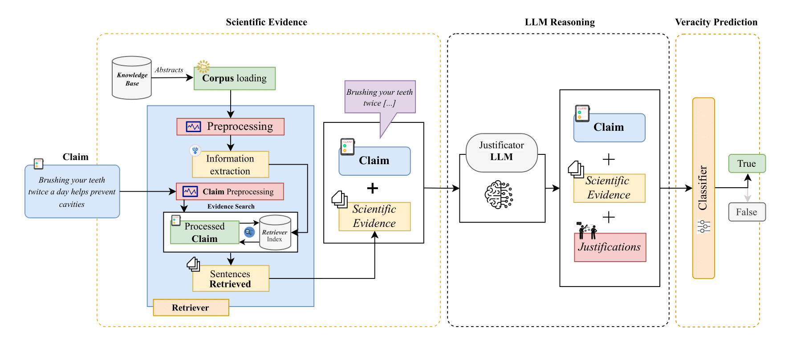

# ✔️🩺 Fact-Checking Biomedical Claims: *C*ombining *E*vidence and *R*easoning (CER)

In the digital age, verifying the accuracy of medical information is crucial to prevent the spread of harmful misinformation. To address this, we have developed an automated fact-checking system that leverages PubMed, a comprehensive biomedical knowledge base, alongside a Large Language Model (LLM) to assess the veracity of medical claims. The system generates justifications for the claims and classifies them using zero-shot and fine-tuned models. Extensive experimentation highlights that fine-tuning improves robustness across diverse datasets, ensuring higher accuracy in fact-checking.

## 📊 Data Source

- **[PubMed](https://pubmed.ncbi.nlm.nih.gov/)**: Our primary source of scientific evidence, containing over 20.6 million biomedical abstracts.
- **Datasets**:
  - **HealthFC**: A dataset of 750 health-related claims from online search queries, curated by *Vladika et al. (2024)*.
  - **BioASQ-7b**: A dataset of 745 biomedical claims from the *BioASQ Challenge, Nentidis et al. (2020)*.

The datasets used for training and testing can be found in the `Datasets` folder of this repository.

## 🛠️ Technologies Used

- **Large Language Models (LLMs)**: We employed **[Mixtral-8x22B-Instruct-v0.1](https://huggingface.co/mistralai/Mixtral-8x22B-Instruct-v0.1)** for reasoning and **PubMedBERT** for the classification of claims.
- **Sparse Retriever**: Utilized for efficient evidence retrieval from PubMed, using an inverted index technique.
- **BM25 Indexing**: Applied to preprocess and index the biomedical abstracts for faster information retrieval.
- **Fine-Tuning**: Implemented to improve the model's classification performance.

## 📑 Methodology

Our approach is structured in three key phases:

1. **Evidence Retrieval**: We extract relevant scientific abstracts from PubMed using the Sparse Retriever to support or refute each claim.
2. **LLM Justification Generation**: The Large Language Model processes the retrieved sentences to generate a coherent justification for each claim.
3. **Veracity Prediction**: A classifier assesses the veracity of the claims (true, false, or lacking enough information), utilizing both zero-shot and fine-tuned models.

The code used to implement the methodology is available in the notebook `Code/Code.ipynb` in the `Code` folder.

### Methodology Overview:

The process begins with the claim, which is preprocessed and compared against a corpus of abstracts (e.g., PubMed) using a sparse retriever (e.g., BM25 index). Retrieved sentences are combined with the claim and passed to an LLM to generate justifications. A fine-tuned classifier then evaluates the claim, scientific evidence and justifications, outputting a prediction of either true or false.

## ✨ Key Features

- **Zero-Shot and Fine-Tuned Classification**: Provides reliable fact-checking without the need for extensive task-specific labeled data.
- **Robustness Across Datasets**: Fine-tuning enhances model performance, even when the training and test sets differ.
- **Efficient Retrieval**: Leverages the Sparse Retriever for quick and accurate evidence extraction from PubMed.
- **Transparency**: Generates justifications to explain the classification of each claim, ensuring transparency and interpretability.

## 🏆 Conclusions

This work demonstrates the efficacy of machine learning in improving the reliability of medical information. Fine-tuning LLMs proves to be a powerful strategy for enhancing accuracy in fact-checking, even across different datasets. Additionally, the generation of justifications provides a level of transparency that is crucial in the medical field.

### References

1. PubMed: [https://pubmed.ncbi.nlm.nih.gov/](https://pubmed.ncbi.nlm.nih.gov/)
2. HealthFC (Vladika et al., 2024): *Health Question Answering with Evidence-Based Medical Fact-Checking*.
3. BioASQ-7b: *BioASQ Challenge, Nentidis et al. (2020)*.
4. Mixtral-8x22B-Instruct-v0.1: [https://huggingface.co/mistralai/Mixtral-8x22B-Instruct-v0.1](https://huggingface.co/mistralai/Mixtral-8x22B-Instruct-v0.1).
